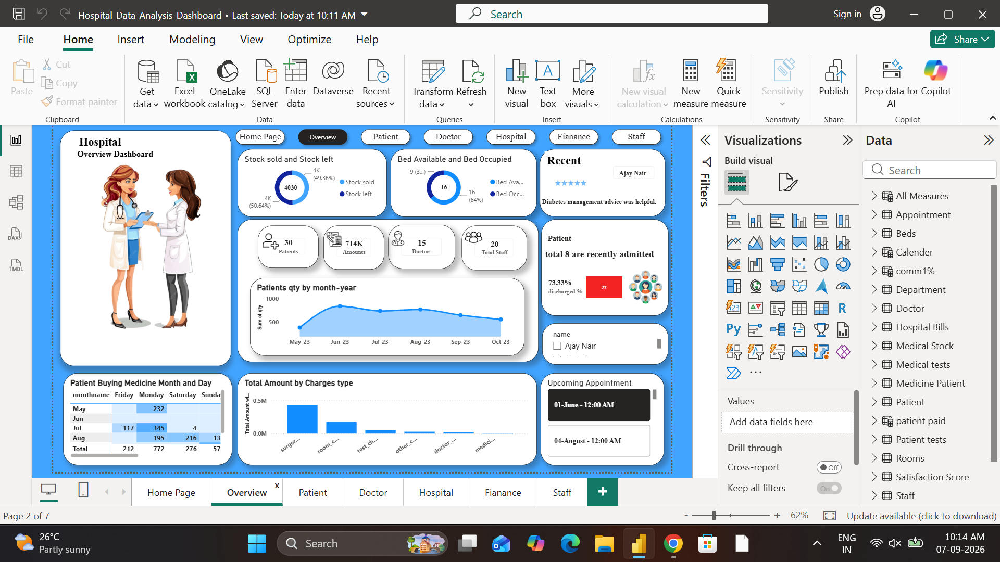

# 🏥 Hospital Data Analysis Dashboard | Power BI

> 📊 An interactive Power BI dashboard designed to analyze hospital operations, patient activity, appointments, billing, medicines, and inventory.

---

## 🚀 Project Overview

This project focuses on transforming hospital data into meaningful business insights using **Microsoft Power BI**.

The dashboard provides an interactive view of hospital performance and helps users understand:

- 👨‍⚕️ Doctor & staff information
- 🧑‍🤝‍🧑 Patient activity
- 📅 Appointment analysis
- 💰 Billing & revenue analysis
- 💊 Medicine & stock management
- 🚚 Supplier information
- 📦 Inventory overview

The main goal is to convert raw hospital data into a **clear, interactive and decision-friendly dashboard**.

---

## 🎯 Project Objectives

✔ Analyze hospital operations efficiently  
✔ Monitor patient and appointment activity  
✔ Understand billing and revenue patterns  
✔ Track medicine and inventory information  
✔ Identify important trends and patterns  
✔ Present insights through interactive Power BI visuals  

---

## 🛠️ Tools & Technologies

| Tool | Purpose |
|------|---------|
| 📊 Power BI | Dashboard & Data Visualization |
| 🔄 Power Query | Data Cleaning & Transformation |
| 🧮 DAX | KPIs & Calculations |
| 🗂️ Data Modeling | Table Relationships |
| 📁 Excel | Data Source / Data Preparation |

---

## 📌 Dashboard Modules

### 👥 Patient Analysis
- Patient records
- Patient-related trends
- Patient distribution

### 📅 Appointment Analysis
- Appointment overview
- Appointment trends
- Doctor-wise analysis

### 👨‍⚕️ Doctor & Staff Analysis
- Doctor information
- Staff overview
- Department-related analysis

### 💰 Billing Analysis
- Billing overview
- Revenue analysis
- Payment-related insights

### 💊 Medicine & Inventory Analysis
- Medicine overview
- Stock availability
- Supplier information
- Inventory monitoring

---

## ⚙️ Data Preparation

The data was prepared using **Power Query**.

### Data cleaning steps included:

- Removing duplicate records
- Handling missing values
- Correcting data types
- Standardizing data
- Transforming columns
- Preparing data for analysis

---

## 🧮 DAX & Data Modeling

DAX was used to create important calculations and KPIs for the dashboard.

The data model was created by establishing relationships between relevant hospital tables such as:

**Patients → Appointments → Doctors → Billing → Medicines → Suppliers → Stock**

This helped create an interactive and connected reporting environment.

---

## 📊 Interactive Features

✨ Interactive charts  
✨ KPI cards  
✨ Slicers  
✨ Filters  
✨ Cross-filtering  
✨ Drill-down analysis  
✨ Dynamic data visualization  

Users can interact with the dashboard to explore different aspects of hospital performance.

---

## 💡 Key Insights

The dashboard helps management answer questions such as:

🔹 How many patients are being handled?  
🔹 How many appointments are recorded?  
🔹 Which doctors or departments have higher activity?  
🔹 What are the billing and revenue patterns?  
🔹 What medicines are available in stock?  
🔹 Which inventory areas require attention?  

---

## 🖼️ Dashboard Preview

---

## 👤 Author

**Sai Khalate**

BSc Computer Science | Aspiring Data Analyst

Skills: Excel | Power BI | SQL | Python

---

## 📌 Disclaimer

This project is created for learning and portfolio purposes. The dataset used is for demonstration/analysis purposes only.

---

⭐ If you found this project useful, feel free to explore the repository and give it a star!

